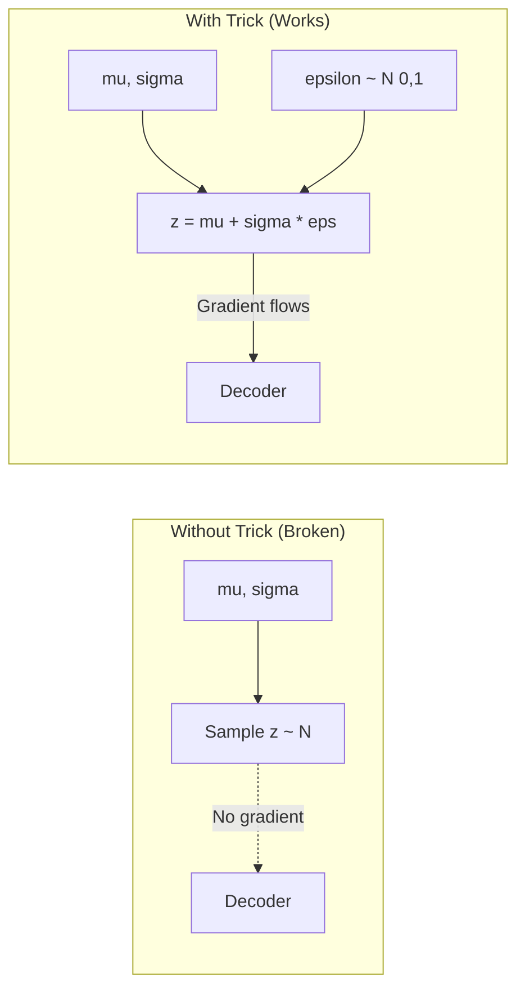
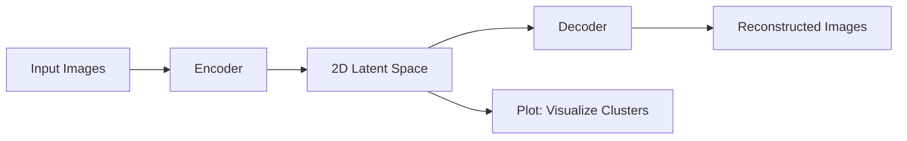

# Autoencoders

An autoencoder is a type of neural network that learns to **compress** (encode) data into a lower-dimensional representation and then **reconstruct** (decode) it back to the original form. The goal is to learn useful, compressed features of the data in an unsupervised manner.

> **Related Files:**
> - [VariationalAutoencoder.md](./VariationalAutoencoder.md) - Detailed explanation of VAE
> - [autoencoder.py](./autoencoder.py) - PyTorch implementations

---

## Core Architecture

```
Input --> [Encoder] --> Latent Space (Bottleneck) --> [Decoder] --> Reconstructed Output
```

| Component       | Description                                                             |
| --------------- | ----------------------------------------------------------------------- |
| **Encoder**     | Compresses input into a lower-dimensional latent representation (z)    |
| **Latent Space**| The compressed representation; also called the "bottleneck" or "code"  |
| **Decoder**     | Reconstructs the input from the latent representation                  |

---

## Key Concepts

### 1. Reconstruction Loss

The model is trained to minimize the difference between input `x` and reconstructed output `x'`:

$$
\mathcal{L}_{recon} = \|x - x'\|^2 \quad \text{(MSE Loss)}
$$

or Binary Cross-Entropy for normalized inputs:

$$
\mathcal{L}_{BCE} = -\sum [x \log(x') + (1-x)\log(1-x')]
$$

### 2. Bottleneck (Latent Space)

- The latent space dimension is **smaller** than the input dimension.
- Forces the network to learn the most important features.
- If latent dim >= input dim, the model may just learn identity mapping (no useful compression).

### 3. Undercomplete vs Overcomplete

| Type            | Latent Dim vs Input Dim | Behavior                                   |
| --------------- | ----------------------- | ------------------------------------------ |
| Undercomplete   | latent_dim < input_dim  | Forces compression; learns useful features |
| Overcomplete    | latent_dim >= input_dim | Risk of learning identity; needs regularization |

---

## Types of Autoencoders

### 1. Vanilla Autoencoder
- Simple encoder-decoder with fully connected layers.
- Good for basic dimensionality reduction.

### 2. Convolutional Autoencoder (CAE)
- Uses Conv2d layers for encoding and ConvTranspose2d for decoding.
- Better for image data; preserves spatial structure.

### 3. Variational Autoencoder (VAE)
- Encodes to a **distribution** (mu, sigma) instead of a single point.
- Enables generating new samples by sampling from the latent space.
- Loss = Reconstruction Loss + KL Divergence.

For a detailed explanation of WHY VAE works this way, see [VariationalAutoencoder.md](file:///c:/Users/kunjs/OneDrive/Projects/llms-from-scratch/docs/ml-and-dl/VariationalAutoencoder.md).

### 4. Denoising Autoencoder (DAE)
- Trained to reconstruct **clean** input from **corrupted** input.
- Adds noise to input, learns robust features.

### 5. Sparse Autoencoder
- Adds sparsity constraint (L1 penalty) on latent activations.
- Encourages the model to use only a few neurons at a time.

$$
\mathcal{L} = \mathcal{L}_{recon} + \lambda \sum |z|
$$

---

## Reparameterization Trick (VAE)

### The Problem

In a VAE, the encoder outputs parameters of a distribution (mean `mu` and variance `sigma`), and we need to **sample** from this distribution to get `z`. But here's the issue:

**Sampling is not differentiable.** You can't backpropagate gradients through a random sampling operation. If you just do `z = sample_from(Normal(mu, sigma))`, the gradient stops there - PyTorch doesn't know how to compute gradients through randomness.

### The Solution

The reparameterization trick rewrites the sampling as:

```
z = mu + sigma * epsilon
where epsilon ~ N(0, 1)  (standard normal, sampled independently)
```

**Why this works:**
- The randomness is now in `epsilon`, which is **external** to the computation graph
- `mu` and `sigma` are just regular tensors that we multiply/add
- Gradients can flow through `mu` and `sigma` normally



### Code Example

```python
def reparameterize(mu, logvar):
    # logvar = log(sigma^2), so sigma = exp(0.5 * logvar)
    std = torch.exp(0.5 * logvar)
    
    # Sample epsilon from standard normal
    eps = torch.randn_like(std)
    
    # Reparameterized sample
    z = mu + eps * std
    return z
```

**Key insight:** We moved the randomness from "inside" the distribution to "outside" as a separate input. The network parameters (mu, sigma) are now involved in deterministic operations that gradients can flow through.

---

## Applications

| Application              | Description                                              |
| ------------------------ | -------------------------------------------------------- |
| Dimensionality Reduction | Like PCA but nonlinear; better for complex data          |
| Anomaly Detection        | Trained on normal data; high reconstruction error = anomaly |
| Image Denoising          | Remove noise from images (DAE)                           |
| Generative Modeling      | VAE can generate new samples by sampling from latent space |
| Feature Learning         | Pre-train encoder, use features for downstream tasks     |
| Data Compression         | Learn compact representations of data                    |

---

## Autoencoder vs PCA

| Aspect              | PCA                    | Autoencoder                 |
| ------------------- | ---------------------- | --------------------------- |
| Transformation      | Linear                 | Nonlinear (neural network)  |
| Flexibility         | Fixed components       | Learnable architecture      |
| Complexity          | Simple, fast           | More complex, slower        |
| Feature Quality     | Good for linear data   | Better for complex patterns |

---

## Latent Space Visualization

For 2D latent space, you can visualize the learned representations:



---

## Common Training Tips

1. **Start simple**: Begin with a small latent dimension and increase if needed.
2. **Batch normalization**: Helps with training stability.
3. **Learning rate scheduling**: Reduce LR on plateau for better convergence.
4. **Data normalization**: Scale inputs to [0, 1] or [-1, 1].
5. **Monitor reconstruction**: Visualize outputs during training to catch issues.

---

## Hyperparameters to Tune

| Hyperparameter     | Description                                      |
| ------------------ | ------------------------------------------------ |
| `latent_dim`       | Size of bottleneck; smaller = more compression   |
| `encoder_layers`   | Depth and width of encoder network               |
| `decoder_layers`   | Should mirror encoder architecture               |
| `learning_rate`    | Typical: 1e-3 to 1e-4                            |
| `batch_size`       | 32-128 is common                                 |
| `beta` (for VAE)   | Weight of KL divergence term                     |

---

## Code Reference

See [autoencoder.py](file:///c:/Users/kunjs/OneDrive/Projects/llms-from-scratch/docs/ml-and-dl/autoencoder.py) for PyTorch implementations of:
- Vanilla Autoencoder
- Convolutional Autoencoder
- Variational Autoencoder (VAE)

---

## Resources

- [Auto-Encoding Variational Bayes (Kingma & Welling, 2013)](https://arxiv.org/abs/1312.6114)
- [Tutorial on Variational Autoencoders](https://arxiv.org/abs/1606.05908)
- [PyTorch VAE Example](https://github.com/pytorch/examples/tree/main/vae)
