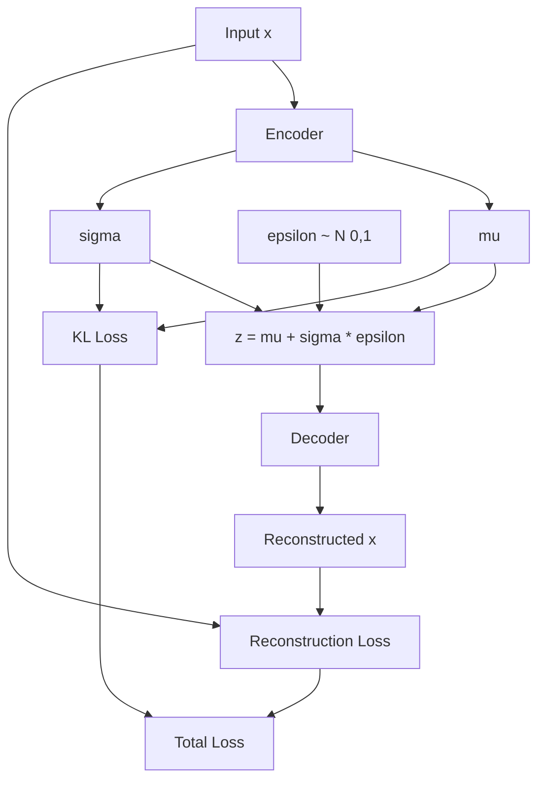

# Variational Autoencoder (VAE)

A VAE is NOT just an autoencoder with some extra math. It solves a fundamentally different problem. Let's build up the intuition.

---

## The Problem with Regular Autoencoders

A vanilla autoencoder learns:
- **Encoder**: Input -> Single point in latent space (z)
- **Decoder**: z -> Reconstructed input

The latent space ends up being **sparse and irregular**. If you pick a random point in the latent space and decode it, you'll likely get garbage. The decoder only knows how to handle the specific points it saw during training.

```
Regular Autoencoder Latent Space:
    *           *
        *
                    *
      *       *
              *

(Scattered points, gaps everywhere)
```

**Problem:** You can't generate new, meaningful samples by sampling from this space.

---

## What VAE Does Differently

VAE forces the latent space to be **continuous and structured** so that:
1. Similar inputs map to nearby regions
2. You can sample ANYWHERE in the space and get meaningful outputs
3. You can interpolate between points smoothly

**Key idea:** Instead of encoding to a single point, encode to a **probability distribution**.

---

## Why Encode to a Distribution?

### Intuition

Imagine you're encoding images of the digit "3". In a regular autoencoder, each "3" maps to one specific point. But in a VAE:

- Each "3" maps to a **cloud of possibilities** (a distribution)
- These clouds overlap in the latent space
- The overlapping forces the decoder to learn smooth transitions

```
VAE Latent Space:
    (~~~)   (~~~)
       (~~~~~~)
    (~~~)  (~~~)

(Overlapping clouds, continuous coverage)
```

### Technically

The encoder outputs two things:
- `mu` (mean): The center of the distribution
- `sigma` (std dev): How spread out the distribution is

This defines a Gaussian distribution: `z ~ N(mu, sigma^2)`

---

## Why Do We Sample?

During training, we don't just use `mu` as our latent code. We **sample** from `N(mu, sigma)`.

**Why?**

1. **Forces robustness**: The decoder sees slightly different z values each time, so it learns to handle a REGION of the latent space, not just one point.

2. **Enables generation**: At inference time, you can sample from `N(0, 1)` (the prior) and decode to generate new data.

3. **Regularization**: Sampling adds noise, preventing overfitting to exact training examples.

```
Training:
    Input "3" --> Encoder --> mu=2.1, sigma=0.3
                                  |
                          Sample z ~ N(2.1, 0.3)
                                  |
                          z = 2.05 (this time)
                                  |
                              Decoder --> Reconstructed "3"

Next batch, same input might give z = 2.18
```

---

## The KL Divergence Term

VAE loss has two parts:

```
Loss = Reconstruction Loss + KL Divergence
```

**Reconstruction Loss:** Make output look like input (same as regular autoencoder)

**KL Divergence:** Force the learned distribution `N(mu, sigma)` to be close to `N(0, 1)`

### Why KL Divergence?

Without it, the network could cheat:
- Set sigma very small (almost zero) -> No sampling noise
- Set mu to be very different values for each input
- Basically becomes a regular autoencoder

KL divergence penalizes this by saying: "Your distributions should look like a standard normal N(0,1)."

This ensures:
- Distributions are centered around 0
- Distributions have reasonable variance
- Different inputs have overlapping distributions

```
Without KL:                    With KL:
    *                              (~~)
              *                 (~~~~)
        *                         (~~)
                *                (~~~)
  (spread out, non-overlapping)  (centered, overlapping)
```

---

## The Full Picture



---

## Generation (After Training)

To generate new samples:

1. Sample `z` from `N(0, 1)` (the prior)
2. Pass through decoder
3. Get new, never-before-seen output

This works because:
- KL divergence forced the encoder to map inputs close to N(0,1)
- Sampling during training forced decoder to handle the full region
- The latent space is now continuous and meaningful

```python
# Generation
z = torch.randn(1, latent_dim)  # Sample from N(0,1)
new_sample = decoder(z)          # Decode to new image
```

---

## VAE vs Regular Autoencoder

| Aspect | Regular Autoencoder | VAE |
|--------|--------------------|----|
| Latent representation | Single point | Distribution (mu, sigma) |
| Latent space structure | Sparse, irregular | Continuous, structured |
| Can generate new samples? | No (or poor quality) | Yes |
| Training involves | Just reconstruction | Reconstruction + KL |
| Loss function | MSE or BCE | Reconstruction + KL divergence |

---

## Common Misconceptions

**"VAE just adds noise to the autoencoder"**
No. The noise (sampling) is a consequence of encoding to a distribution. The real goal is learning a structured latent space.

**"KL divergence is just regularization"**
It's more than that. It shapes the geometry of the latent space to match a prior (N(0,1)), enabling generation.

**"sigma is the uncertainty of reconstruction"**
No. sigma describes the spread of the encoding distribution in latent space, not output uncertainty.

---

## Summary

1. Regular autoencoders encode to **points** -> can't generate
2. VAE encodes to **distributions** -> continuous latent space
3. **Sampling** during training forces decoder to handle regions
4. **KL divergence** keeps distributions centered and overlapping
5. Result: You can sample from N(0,1) and generate new data

---

## Code Reference

See [autoencoder.py](file:///c:/Users/kunjs/OneDrive/Projects/llms-from-scratch/docs/ml-and-dl/autoencoder.py) for the VAE implementation with reparameterization trick.
